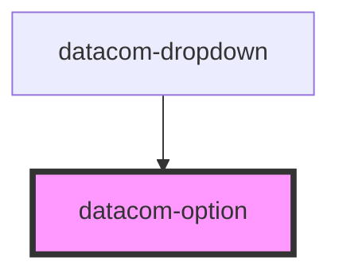

# datacom-dropdown-option

<!-- Auto Generated Below -->

## Properties

| Property   | Attribute  | Description                                                                                                                                      | Type                     | Default     |
| ---------- | ---------- | ------------------------------------------------------------------------------------------------------------------------------------------------ | ------------------------ | ----------- |
| `icon`     | `icon`     | Icon name                                                                                                                                        | `string`                 | `undefined` |
| `index`    | `index`    | Option id                                                                                                                                        | `number`                 | `0`         |
| `label`    | `label`    | Display label                                                                                                                                    | `string`                 | `undefined` |
| `mode`     | `mode`     | Display type (mostly private) - list = display as item in drop down list (default) - standalone = display a standalone item outside of the list. | `"list" \| "standalone"` | `'list'`    |
| `search`   | `search`   | Text for use in option search                                                                                                                    | `string`                 | `undefined` |
| `selected` | `selected` | True if the option is selected                                                                                                                   | `boolean`                | `false`     |
| `src`      | `src`      | Icon source                                                                                                                                      | `string`                 | `undefined` |
| `value`    | `value`    | Form submit value                                                                                                                                | `string`                 | `undefined` |
| `visible`  | `visible`  | Show the item                                                                                                                                    | `boolean`                | `true`      |

## Events

| Event        | Description | Type                  |
| ------------ | ----------- | --------------------- |
| `deselected` |             | `CustomEvent<number>` |
| `selected`   |             | `CustomEvent<number>` |

## Dependencies

### Used by

 - [datacom-dropdown](.)

### Graph

----------------------------------------------

*Built with [StencilJS](https://stenciljs.com/)*
